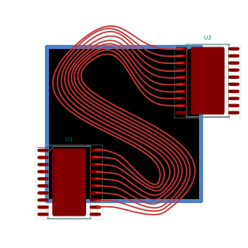

Note: Due to the constantly moving target of the KiCad file format, and also more importantly, the [new IPC plugin system](https://dev-docs.kicad.org/en/apis-and-binding/ipc-api/), this plugin hasn't been fully tested in 9, and support will be extremely limited. Some people have seen success in version 9, and I'm still happy to accept PRs, but I'm unlikely to be diving into it myself.




# Stretch

Allow your PCBs to _stretch_!

## The Process

In KiCad:


In Inkscape:


Modify:


Back to KiCad:


## Why?

This was written to address some frustrations with other "artistic" PCB workflows.
KiCad and other traditional ECAD software has poor support for curved lines, importing and processing of images/drawings, and many other features that can be expected in proper vector software.


Tools intended to bridge the gap are also lacking. [PCBmodE](https://github.com/boldport/pcbmode) is the probably the best tool out there from a pure PCB art standpoint, and it is excellent, but there is no schematic tool. And with that, no ability to handle extremely complex, functional PCBs.

KiCad has a tool to export to SVG. SVG-To-Shenzen is a tool to convert SVG files into KiCad files. Both of these are single-direction tools.

Stretch goes both ways. Much as the ideal schematic->PCB capture workflow does not exist, the PCB layout aspect must go hand-in-hand with the art aspect.

Users can start by drawing a schematic and laying out a PCB, then bring it into Inkscape to arrange a thousand LEDs into a flower arrangement, then bring it back into KiCad to lay out traces, back into Inkscape to curve the traces, back into KiCad to change their microcontroller and few pin assignments, back into Inkscape to draw out some silkscreem patterns, back into KiCad to run DRC, and so on.
The workflow is intended to be seamless and painless to go back and forth.

## Installation

- Copy this main Stretch folder into your KiCad plugin folder at `Tools->External Plugins...->Open Plugin Directory`
- Ensure the BeautifulSoup4 library is installed (e.g. run `pip install bs4` in a system command line, see Troubleshooting below for details)
- Open up a PCB and then in Pcbnew, got to `Tools->External Plugins...->Refresh Plugins`
- This has been tested on KiCad 6 and later. For a KiCad 5 legacy version, check the releases.

### Troubleshooting

If the buttons do not show up on the toolbar, the plugin may be installed but not loading successfully. The most common cause is a missing `bs4` library, which is required to run Stretch. Firstly, check to see if there are any error messages by opening up the Scripting Console from `Tools->Scripting Console` and in the "Shell" section at the top, click after the `>>>` prompt (you may have to scroll down) and type `from com_github_jarrettr_stretch import Stretch`. If you get the `>>>` prompt again without any other text, the plugin is loading correctly. Otherwise, there will be an error message: pay attention to the last line.

If it says `No module named 'bs4'`, BeatifulSoup is not installed. If you have installed it but are still getting this error, try using `pip3` instead of `pip`, or install the library with your package manager (e.g. `apt install python3-bs4`).

It's also possible to have multiple installations of Python, in which case you need to run the `pip` command from the correct installation, which can be difficult to determine. This is often the case on MacOS, where KiCad uses its own installation of Python than the system installation. To find out where the Python that KiCad is using is, go back to the `>>>` prompt above and type:
```
import sys
print(sys.base_exec_prefix)
```
This will print out a path (e.g. `/usr` or `/Applications/KiCad/KiCad.app/Contents/Frameworks/Python.framework/Versions/Current`). You should be able to add `/bin/pip` (or `pip3`) to this path and run e.g. `/Applications/KiCad/KiCad.app/Contents/Frameworks/Python.framework/Versions/Current/bin/pip3 install bs4` to install BeautifulSoup in the Python installation that KiCad is using.

After installing BeautifulSoup, use `Tools->External Plugins->Refresh Plugins` or restart KiCad to attempt re-loading Stretch. If all went well, you should have the up/down buttons on your toolbar.

If there is an error message other than missing `bs4`, try searching with the error message, and if that is inconclusive, open an issue in this repository and copy/paste the error message here.

## Workflow

- In Kicad: Open up your KiCad project, and then your PCB in Pcbnew
- Hit the "UP" arrow in your plugin bar  *(Stretch up to SVG)*
- In Inkscape: There is now a file in your PCB directory called "out.svg". Open it in Inkscape, or your preferred vector software
- Make your modifications. Bend some lines, draw some pictures, rotate some footprints
- Save your SVG
- In KiCad/Pcbnew: Hit the "DOWN" arrow  *(Stretch down to PCB)*
- Close Pcbnew and then re-open the PCB in the main KiCad window
- Continue tweaking. Change some nets, add more components
- Hit the "UP" arrow again to go right back to SVG
- In Inkscape: File->Revert to quickly reload the SVG. **Alt-F** and then **V** works as well
- Do it all again.

In Inkscape, go to `Layer->Layers...` to display a window that will allow you to show/hide/view specific PCB layers. `Edit->XML Editor...` is also a good tool to debug why something isn't working, or see what's happening under the hood. Each object has some metadata that is associated with the KiCad PCB data, so objects without this data won't work properly. It's better to copy an existing trace/zone/via/text than to try to create one from scratch.

## Limitations

Fonts will look different in your vector software than in KiCad. This includes positioning, sizing, and fonts. It will import back into the PCB editor undamaged, however.

Closing the PCB window and opening it again is annoying - There is no way to programmatically reload it from disk, as of KiCad 5. Perhaps rebuilding the existing PCB from file using the API is possible, or KiCad 6 has added some other method.

Metadata that doesn't need to be processed, or do not yet have processors written are still stored. They are unchanged and stored in the SVG so they can be imported properly back into the PCB.

Most data is processed properly! Diffs on some mildly complicated 4-layer boards are coming back clean.

This is still kind of a hack. Obviously, save and backup everything before using this, and **check your gerbers carefully** before purchasing anything. One common failure mode is that *(Stretch down to PCB)* will generate a corrupt/invalid PCB. In that case, fix the error (and report the issue), and open the backup. Clicking *(Stretch down to PCB)* will leave the backup untouched, and you can open the main file again.


I am happy to accept issues, or pull requests, and example PCBs that break the software. I may be slow to fix issues by myself, so feel free to dive in yourself!
