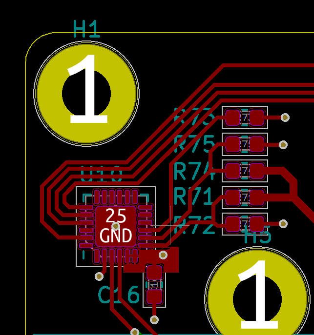
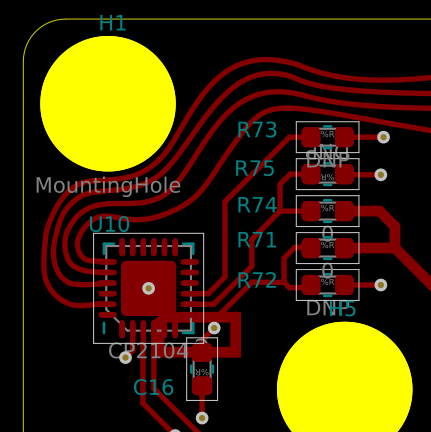
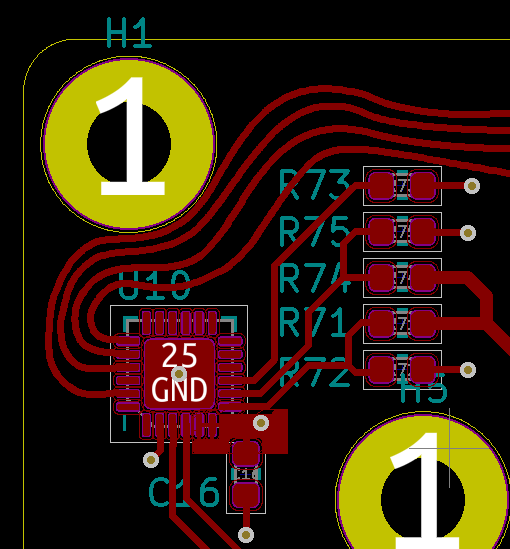

# Stretch

Allow your PCBs to _stretch_!

## The Process

In KiCad:

In Inkscape:

Modify:

Back to KiCad:

## Why?

This was written to address some frustrations with other "artistic" PCB workflows.
KiCad and other traditional ECAD software has poor support for curved lines, importing and processing of images/drawings, and many other features that can be expected in proper vector software.

Tools intended to bridge the gap are also lacking. [PCBmodE](https://github.com/boldport/pcbmode) is the probably the best tool out there from a pure PCB art standpoint, but there is no schematic tool, and with that, no ability to handle extremely complex, functional PCBs.

KiCad has a tool to export to SVG. SVG-To-Shenzen is a tool to convert SVG files into KiCad files. Both of these are single-direction tools.

Stretch goes both ways. Much as the ideal schematic->PCB capture workflow does not exist, the PCB layout aspect must go hand-in-hand with the art aspect.

Users can start by laying out a PCB, then bring it into Inkscape to arrange a thousand LEDs into a flower arrangement, then bring it back into KiCad to lay out traces, back into Inkscape to curve the traces, back into KiCad to change their microcontroller and few pin assignments, back into Inkscape to draw out some silkscreem patterns, back into KiCad to run DRC, and so on.
The workflow is intended to be seamless and painless to go back and forth.

## Installation

- Copy the Stretch folder into your KiCad plugin folder
- Install dependencies using `D:\Programs\KiCad\bin\python.exe -m pip install bs4` (but substituting your own KiCad\bin path)

## Workflow

- In Kicad: Open up your KiCad project, and then your PCB in Pcbnew
- Hit the "UP" arrow in your plugin bar  *(Stretch up to SVG)*
- In Inkscape: There is now a file in your PCB directory called "out.svg". Open it in Inkscape, or your preferred vector software
- Make your modifications. Bend some lines, draw some pictures, rotate some footprints
- Save your SVG
- In KiCad/Pcbnew: Hit the "DOWN" arrrow  *(Stretch down to PCB)*
- Close PCBNew and then re-open the PCB in the main KiCad window
- Continue tweaking. Change some nets, add more components
- Hit the "UP" arrow again to go right back to SVG
- In Inkscape: File->Revert to quickly reload the SVG. **Alt-F** and then **V** works as well
- Do it all again.

In Inkscape, go to `Layer->Layers...` to display a window that will allow you to show/hide/view specific PCB layers. `Edit->XML Editor...` is also a good tool to debug why something isn't working, or see what's happening under the hood. Each object has some metadata that is associated with the KiCad PCB data, so objects without this data won't work properly. It's better to copy an existing trace/zone/via/text than to try to create one from scratch.

## Limitations

Fonts are iffy, and dimensions may be a little off. This imports properly back into the PCB if untouched, however.

Closing the PCB window and opening it again is annoying - There is no way to programmatically reload it from disk, perhaps rebuilding the existing PCB from file, using the API is possible.

Metadata that doesn't need to be processed, or do not yet have processors written are stored as-is so they can be dumped back into the PCB wholesale.

Most data is processed properly though! Diffs on some mildly complicated 4-layer boards are coming back clean.

This is still kind of a hack. Obviously, save and backup everything before using this, and **check check check** your gerbers before purchasing anything.

I am happy to accept issues, or pull requests, and example PCBs that break the software. I may be slow to fix issues on myself, so feel free to dive in yourself!